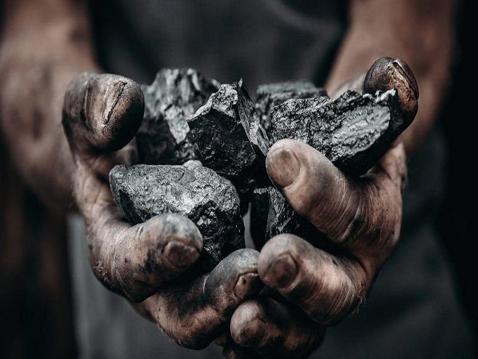
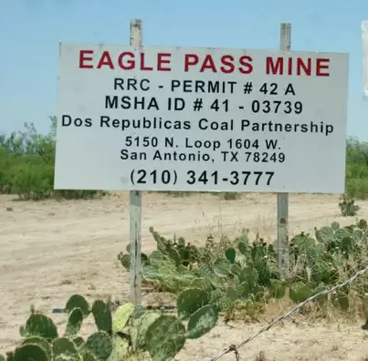
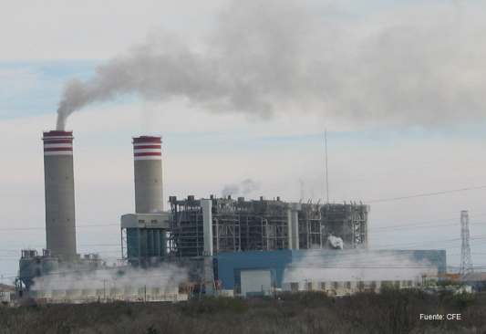

> **Punto de inflexión**: el desarrollo de la técnica de <mark>fracturación hidráulica en Estados Unidos<mark> que comienza 
con la reforma del **Clean Water Act** como punto de inflexión.  

En el centro de la actual tendencia por el desarrollo de proyectos de infraestructura 
para el traslado de Gas Natural Licuado (LNG) en el noroeste de México tenemos el 
desarrollo de la técnica de fracturación hidráulica en Estados Unidos que comienza 
con la reforma **Energy Policy Act de 2005**  “Halliburton Loophole”

Esta reforma se impulsó durante la administración del presidente republicano de origen 
Texano George W. Bush, cuyos vínculos familiares con la industria petrolera son ampliamente documentados. 

Una iniciativa del vicepresidente Dick Cheney ex CEO de Halliburton , 
la empresa responsable de escalar comercialmente la técnica de fracturación hidráulica. 
Este hecho, ha significado la transformación del escenario geo-energético global 
impactando la región noroeste de México de manera crucial. 
La figura de Dick Cheney es un clásico ejemplo de riesgo moral y conflicto de intereses. 

Entre otras cosas una vez en el gobierno, la empresa Halliburton obtuvo millonarios
contratos en la Guerra de Irak (reparación de infraestructura petrolera).

**Cuestionable ser Juéz y parte**, participar financieramente en una industria que se pretende regular.

* Strategic economic activities  **Coal mining** and **electricity** generation burning coal as input. 

Fuente: [MICARE MINOSA  Dos Repulicas Coal Partnership]()  

* Binational economic integration: Comlementary **Coal imports** (*Dos Republicas Coal partnership* **MINOSA** at Eagle Pass Maverick County, Texas) and electricity export potential. Coahuila-Texas **grid**. 

Fuente: San Antonio News  

* Local **air pollution** and regional public health issues with relevant **social cost**. <cite>[^4]</cite>

[^4]: Epidemiological studies with clinical perspective that have studied the link between Asthma and air pollution. Guarnieri & Balmes, 2014; Ryan J. Fiter & Cleven, 2023; SEMARNAT-CEPAL, 2004

---

### Transborder implications


            
 

---

* A region hosting the biggest **sulfur dioxide** SO2 contamination source among carbon-burning electricity generation plants in North America. (2,869 sites, including all US and Canadian plants). As well as the first place in the group of **nitrogen oxides** (NOx) <cite> NACEC [^1]</cite>

Fuente: CFE 

[^1]: See full report on  [CEC](http://www.cec.org/es/publications/emisiones-atmosfericas-de-las-centrales-electricas-en-america-del-norte-2/).

* Coahuila-Texas border:  Higher than national morbidity rates for **respiratory diseases**

> **Goal**: Contribute to understand the relationship between <mark>environmental<mark> factors of anthropogenic origin and the health conditions of the population. 

