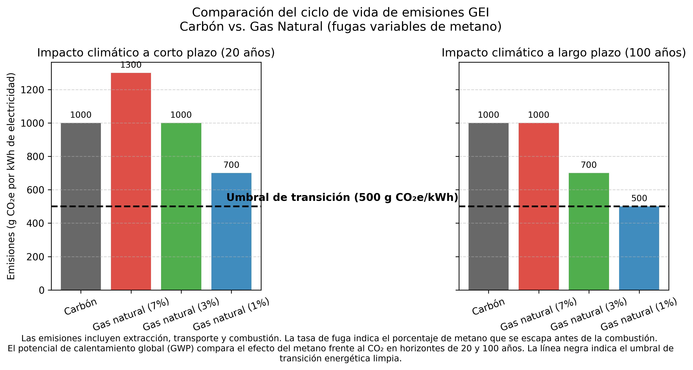

###### El impulso para la comercialización global del gas natural se ha hecho bajo el amparo de la narrativa de la transición energética.

### Definición:
> **La transición energética global**, entendida como el proceso en el que las sociedades a escala mundial llevan a cabo estrategias para reducir<mark>  el uso de combustibles de alto impacto ambiental (Naciones Unidas, 2023.).

### Contraste de emisiones Carbón vs. Gas Natural. 

## México:  Un país dependiente de la energía proveniente de Estados Unidos.
Indicadores Críticos

+	Declive del 42.6% en producción doméstica 2012-2022

+	Incremento del 24.1% en consumo 2012-2022

+	Dependencia de importaciones de EE.UU. superará 50% para 2030

+ 	48% de generación eléctrica usa gas natural

+	Solo 46.8% de gasoductos son propiedad del Estado

####  Expansión de Infraestructura 2018-2024

+	3,050 km de nuevos gasoductos

+	48.9% en región noroeste

+	Proyectos emblemáticos en Sonora

***
###  Coloquio anual de políticas públicas 

#  Gracias por su atencion.  Noviembre 24, 2025.
jlmanzanaresrivera@colef.mx

<!-- Return to Home Page -->

  <a href="/" style="background-color: #2E86AB; color: white; border: none; padding: 10px 20px; border-radius: 5px; cursor: pointer; font-size: 14px; text-decoration: none; display: inline-block;">
    ← Return to Home
  </a>

