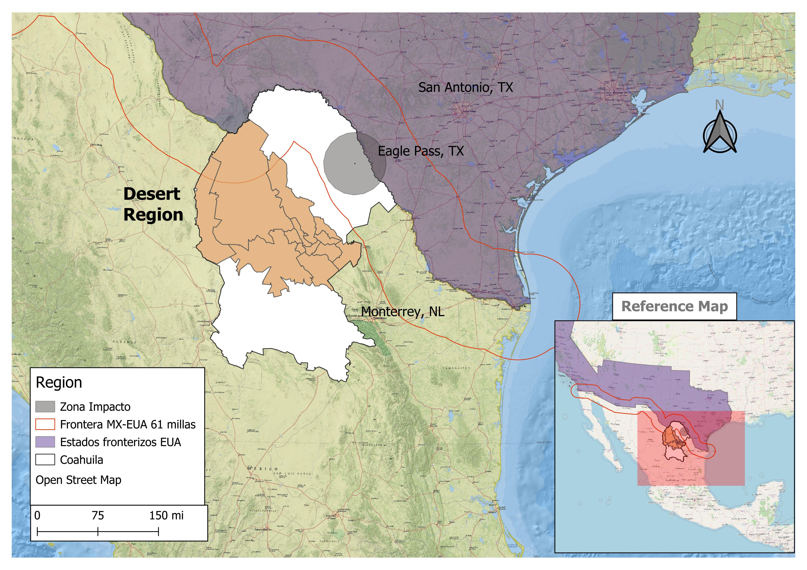
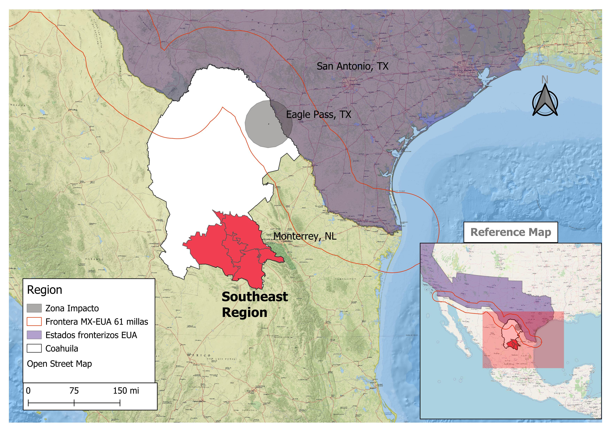

* Main data source: National Health Information System.
This is a **public-official data repository**. It covers patients in all public health institutions.  Available at:  [SINAIS](http://www.dgis.salud.gob.mx/contenidos/basesdedatos/bdc_egresoshosp_gobmx.html)

* **18 years** of information startitn at 2004 ending  2022.

* **Definition:** According to the Ministry of Health (SSA), a **hospital discharge** is defined as the release of a patient from the inpatient services of a hospital.

This concept does not include internal transfers—such as moving a patient from one department to another within the same hospital—nor does it include healthy newborns in the same hospital (SINAIS, 2024).

* **Geographical coverage:**  38 Municipalities and **5 regions** within the Coahuila State.   

1. **Border Region**.

2. **Coal mining Region**

3. **Desert Region**

4. **Laguna Region**

5. **South east Region**

* Relative concentration. Spatial comparision using **Local Incidence Index** as follows: 

$$
LII = \dfrac{\left( \dfrac{e_{i}}{\sum_{i=\text{A00}}^{\text{U99}} j} \right)}{\left( \dfrac{e_{i}}{\sum_{i=\text{A00}}^{\text{U99}} N} \right)}
$$

Where $$\( e_{i} \)$$ represents the number of hospital discharges for category *i*  in the range ICD-10 J45.0–J46.x,  *j*  indicates a specific state of the country, and  *N*  represents the national level of comparison.

This index allows for the evaluation of morbidity conditions in a specific location for a particular illness relative to a reference **geographic area**, at a specific point in time 
*t*

* **Kernel density** funtions to explore **age distribution** of patients across the whole country with confidence intervals. 

* Age adjusted morbidity **rates**. 
