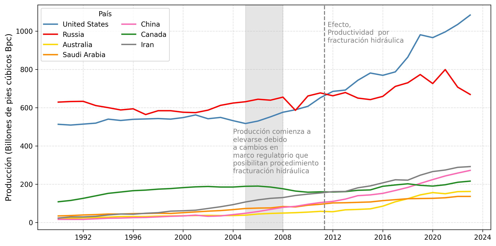
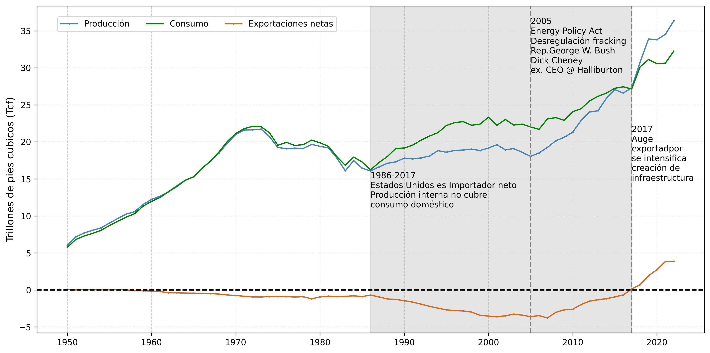

## Estados Unidos. Líder productor mundial de LNG.

**Figura 1.** Producción gas natural. Principales países 1980-2024.

Fuente: Elaboración propia con datos de (Enerdata, 2025). 

Estados Unidos se ha convertido en el **líder productor mundial** y es proveedor de importantes socios  comerciales en Asia. 

### Japón, Corea del sur, Taiwán capturan **un tercio** de las importaciones mundiales. Potentes demandantes por su magnitud son China e India. 

**Figura 2**.  Gas natural en Estados Unidos. Balance entre producción, consumo interno y exportaciones 1950-2023.

Fuente Elaboración propia con datos de (Energy Information Agency, 2025). 

#### El **superávit** generado ha creado el incentivo económico de la **industria energética** estadounidense por desarrollar infraestructura con el propósito de transportar los excedentes desde los sitios de producción hasta los mercados destino, incluida la demanda de consumidores en Asía, lo que **implica contar con rutas eficientes en el océano Pacífico**.

La **desequilibrio geográfica** entre las zonas de **disponibilidad-extracción-exportación** y aquellas que impulsan los procesos de **demanda-importación-consumo**, ha resultado en el desarrollo de estrategias de abastecimiento que se materializan en proyectos de infraestructura trans regionales. 

---

<!-- Return to Home Page -->

  <a href="/" style="background-color: #2E86AB; color: white; border: none; padding: 10px 20px; border-radius: 5px; cursor: pointer; font-size: 14px; text-decoration: none; display: inline-block;">
    ← Return to Home
  </a>

