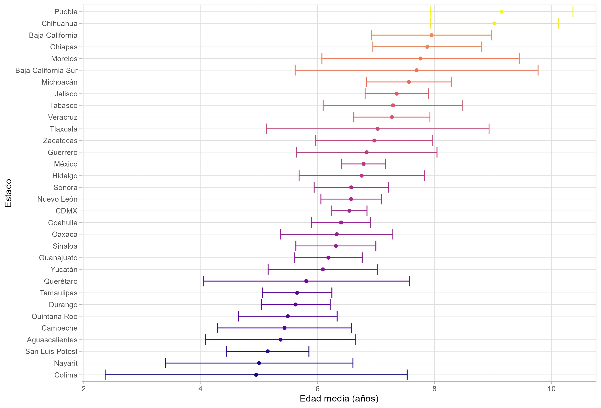
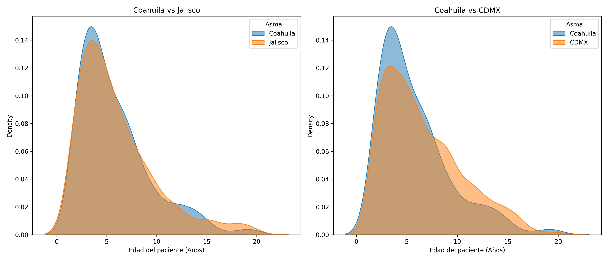
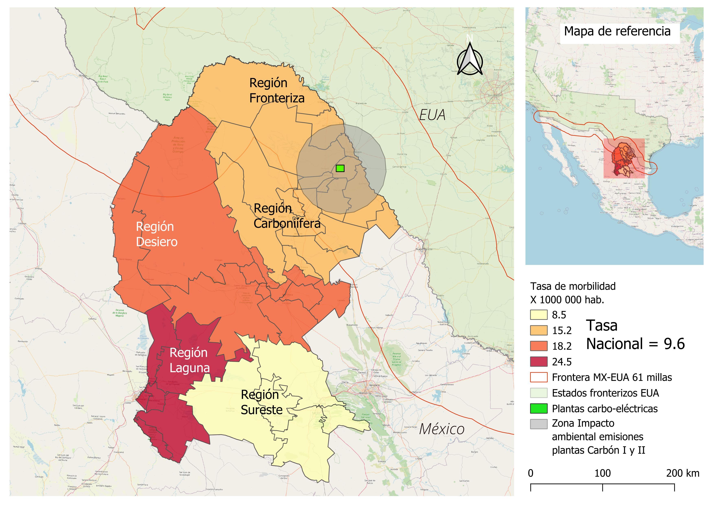
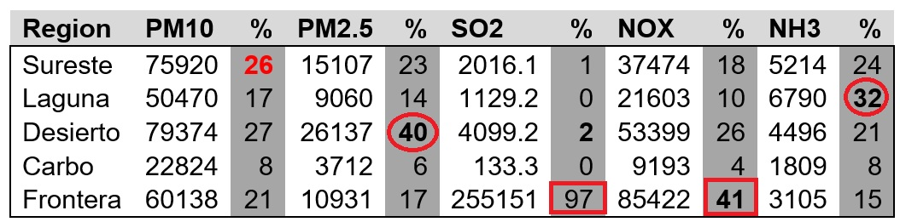

## Estados Unidos. Líder productor mundial de LNG.

Fuente: Elaboración propia con datos para los años 2004 a 2022 (SINAIS, 2022). 

Although the proposed indicator is a relative measure of concentration and **controls for the population size** of the states compared to the national level, the age-specific structure in these geographic areas could introduce biases in the estimation of the Relative Concentration Index (ILI).

Therefore, the age distribution by hospital discharge for the case of Coahuila is explored below, based on the construction of **Kernel density curves** according to Chen (2017).

**Figure  3** Average age of hospital discharges by State 2022. (T-test with 95% confidence intervals).

Fuente: Elaboración propia con datos de (SINAIS, 2022) 

**Figure 4**. Age distribution for hospital discharges. asthma patientes in Coahuila, CDMX, and Jalisco 2022.

Fuente: Elaboración propia con datos de (SINAIS, 2022)Fuente:Fuente: Datos de (Consejo Nacional de Población, 2017; SINAIS, 2022).[^2]</cite>

[^2]:  Air pollutants for which acceptable levels of exposure have been determined and air quality standards have been set.The abbreviation Mg stands for megagrams, which is equivalent to metric tons (1 Mg = 1,000 kilograms or approximately 2,204.62 pounds). In environmental contexts, such as the reporting of criteria pollutant emissions, quantities are often expressed in megagrams per year (Mg/year) to denote the mass of pollutants emitted annually.See Intergovernmental Panel on Climate Change (IPCC) for additional details.
The primary source of ammonia emissions comes from livestock waste and the application of nitrogen-based fertilizers). 

 **Source**: Coahuila state Environmental Health Ministry. [Criteria pollutant emissions inventory](https://sma.gob.mx/sga-inventario-de-emisiones-ano-base-2014/) <cite>[^3]</cite>
 
[^3]: Recent studies on dust and health have been conducted by  Herrera-Molina, E., Gill, T. E., Ibarra-Mejia, G., & Jeon, S. (2021). Associations between dust exposure and hospitalizations in El Paso, Texas, USA. Atmosphere, 12(11), 1413 

---

<!-- Return to Home Page -->

  <a href="/" style="background-color: #2E86AB; color: white; border: none; padding: 10px 20px; border-radius: 5px; cursor: pointer; font-size: 14px; text-decoration: none; display: inline-block;">
    ← Return to Home
  </a>

